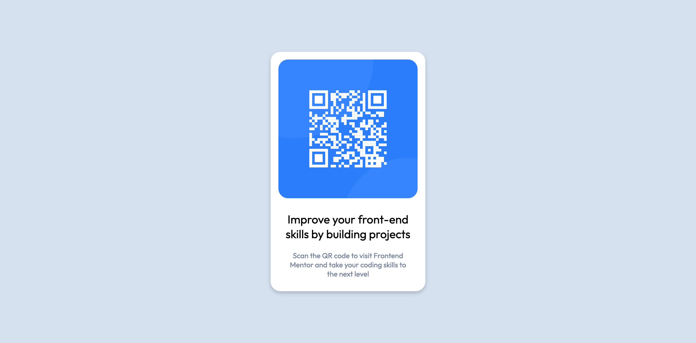

# Frontend Mentor - QR code component solution

This is a solution to the [QR code component challenge on Frontend Mentor](https://www.frontendmentor.io/challenges/qr-code-component-iux_sIO_H).
## Overview

### Screenshot

### Links

- Solution URL: [Add solution URL here](https://github.com/thbdmtt/qrcode)
- Live Site URL: [Add live site URL here](https://thbdmtt.github.io/qrcode)

### Built with

- HTML5
- CSS

### What I learned

I just wanted to refresh on how this works, but this one was too easy, let's move on

## Author

- GitHub - (https://github.com/thbdmtt/)
- Frontend Mentor - @thbdmtt
